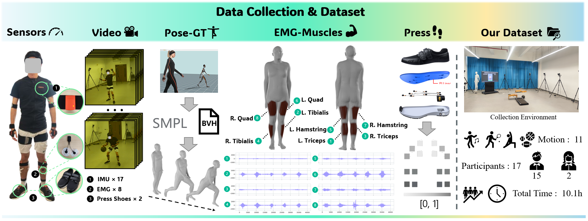
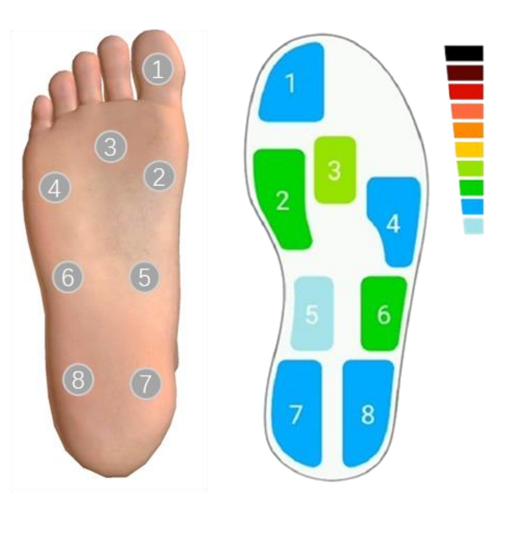

# KineticsSense-Dataset
Official dataset repository for the KineticsSense project: Wearable IMU, Pressure, and EMG data for lower-limb analysis.

<p align="center">
  
</p>

The visual modality is not currently included in the dataset and is still being sorted out.

### Format of Dataset
Download the "KineticsSense_Dataset" folder under this project to get the data. Once downloaded, your directory might appear as follows:
```bash
KineticsSense_Dataset
└── raw
    ├── U_0
    │   ├── Badminton
    │   │    ├── 0.npz
    │   │    ├── 1.npz
    │   │    ├── ...
    │   │    └── 9.npz
    │   ├── Basketball
    │   ├── Left_Leg_Kick
    │   ├── ...
    │   └── Walk
    ├── U_1
    │   ├── Badminton
    │   ├── Basketball
    │   ├── Left_Leg_Kick
    │   ├── ...
    │   └── Walk
    ├── ...
```

We have anonymized the data. **U_{i}** represents different participants, For example, "U_0" represents participant 0. This folder contains 11 different actions, including Badminton, Basketball, Left_Leg_Kick, etc.Under each folder of actions, there are several **.npz** files, each contain 20 seconds of different modal data. Although all modes have different sampling rates, the actual timestamps are aligned, supporting up and down sampling. The data is encapsulated in a dictionary:
```bash
data = {
        "pose": np.array(POSE_list[i]),
        "imu_ori": np.array(IMU_ori_list[i]),
        "imu_acc": np.array(IMU_acc_list[i]),
        "emg": np.array(EMG_list[i]),
        "press": np.array(PRESS_list[i])
        }

# the shape of each kind of data
pose:(1200, 24, 3)
imu_ori:(1200, 17, 3, 3)
imu_acc:(1200, 17, 3)
emg:(40000, 8)
press:(400, 16)
```

### Pose data
**Pose data** represents human posture data, conforming to the **SMPL format**, containing 24 main key points, each of which contains the Euler angle information of its rotation. The data is collected at a sampling rate of 60Hz. The specific format is as follows:
```bash
Pelvis(0)
|-- L_Hip(1)
    |-- L_Knee(4)
        |-- L_Ankle(7)
            |-- L_Foot(10)
|-- R_Hip(2)
    |-- R_Knee(5)
        |-- R_Ankle(8)
            |-- R_Foot(11)
|-- Spine1(3)
    |-- Spine2(6)
        |-- Spine3(9)
            |-- Neck(12)
                |-- Head(15)
            |-- L_Collar(13)
                |-- L_Shoulder(16)
                |-- L_Elbow(18)
                    |-- L_Wrist(20)
                        |-- L_Hand(22)
            |-- R_Collar(14)
                |-- R_Shoulder(17)
                |-- R_Elbow(19)
                    |-- R_Wrist(21)
                        |-- R_Hand(23)
return (frame, 24, 3):pose
```
### IMU data
The **IMU data** is divided into two parts, **imu_ori** and **imu_acc**, which represent angular velocity and acceleration respectively. Ori is represented by a 3x3 rotation matrix, and acc is the acceleration component in the xyz direction. The data contains a total of **17** different IMU sensors, spread throughout the body, and the coordinate systems between each sensor have been aligned. The data is collected at a sampling rate of 60Hz.
```bash
'Pelvis' : 0
'T8' : 1 (Represents the upper torso)
'Head' : 2
'Right Shoulder' : 3
'Right Upper Arm' : 4
'Right Forearm' : 5
'Right Hand' : 6
'Left Shoulder' : 7
'Left Upper Arm' : 8
'Left Forearm' : 9
'Left Hand' : 10
'Right Upper Leg' : 11
'Right Lower Leg' : 12
'Right Foot' : 13
'Left Upper Leg' : 14
'Left Lower Leg' : 15
'Left Foot' : 16
```

### EMG data
**EMG data** mainly collects lower limb data, including **8** channels for the left and right legs. The muscle groups corresponding to the data can be viewed below. The data is collected at a sampling rate of 2000Hz.
```bash
'L. Triceps(Left Lower Leg Back)' : 0
'L. Tibialis(Left Lower Leg Front)' : 1
'R. Triceps(Right Lower Leg Back)' : 2
'R. Tibialis(Right Lower Leg Front)' : 3
'L. Hamstring(Left Upper Leg Back)' : 4
'L. Quad(Left Upper Leg Front)' : 5
'R. Hamstring(Right Upper Leg Back)' : 6
'R. Quad(Right Upper Leg Front)' : 7
```

### Pressure data
The pressure data includes 16 sampling points of plantar pressure data, 8 points on each foot. The sampling rate of the data is 20Hz. The order of the specific points is shown in the figure below. The specific order of data arrangement is 1-8 of the left foot first, then 1-8 of the right foot.

<p align="center">
  
</p>

